# SegGPT Fine-Tune  
### conda 환경 설정  
---
```bash
conda env create -f segGPT.yml
```  
### pretrained 가중치 가져오기
---
```bash
wget https://huggingface.co/BAAI/SegGPT/raw/main/seggpt_vit_large.pth
```  

1. **Data format**  
```
./dataset/train_dataset
                ├── train
                │   ├── all image
                └── val
                    ├── all label (which has same name with images)

```  
이렇게 만들기 위해서 **transform_data_to_one.ipynb** 파일을 사용했습니다.

2. **Code correction log**  

``` python
def _lbl_random_color(self, label: np.ndarray, color_palette: np.ndarray):
        result = np.zeros((label.shape[0], label.shape[1], 3), dtype=np.uint8)

        # for i in range(self.n_classes):
        #     result[label==i] = color_palette[i]
        result[label==0] = color_palette[0]
        result[label!=0] = color_palette[1]
        
        return result
```  
정답 레이블을 두가지 랜덤 색상으로 바꾸어줍니다. 검은색과 흰색으로 설정할 경우, 학습이 정상적으로 진행되지 않고, 스텝이 진행될 수록 예측값이 검은 색만 나오게되었습니다. 따라서 이렇게 랜덤하게 색상을 계속 바꿔가면서 학습을 하여야 스텝이 지나도 정상적으로 예측이 진행됩니다.

3. **전반적인 학습과정**  
* **Data 변형 : Input Data Format**  
H = 488, W = 488  
이미지 2개가 위아래로 합쳐져 (Batch size, 3, H*2, W) 형태로 입력됩니다. 정답 레이블도 마찬가지입니다.  
이때 정답 레이블은 위에서 언급한대로, 랜덤 색상 2개를 뽑아, 흰색 영역과 검은색 영역이던 원래의 레이블을 다른 색상으로 채우게됩니다.  
그리고 랜덤한 위치에 마스크를 씌우게 됩니다. config/Base.json에서 발견되는 mask_ratio 옵션은 이 마스크의 비율을 결정합니다.  

* **Agent**  
전반적인 학습과정은 Agent 클래스가 담당합니다.  
1. do_training으로 학습시작
2. step메서드로 모델로부터 예측값을 받음. (loss는 모델 안에서 동시에 계산됨.)
3. 만들어진 pred가 iou 메서드로 들어가, iou를 계산함과 동시에 cmap_to_lbl 함수를 이용해 기존에 pred를 l2거리를 계산해 레이블 이미지를 생성한다.  
이미지가 16x16패치로 쪼개진 상태로 각각 ViT로 들어가 나온 예측값인만큼, 각 패치 경계도 보이고, 흐릿한 이미지를 가지는데 이러한 예측을 깔끔하게 만들어줌. 
 ### 학습
1. base.json 파일로 학습 데이터 경로 수정 및 조건 수정
2. 학습 시작 명령
```bash
python train.py --port {안쓰는 port 입력}
```
3. tensorboard
```bash
//train.py 가 있는 디렉토리로 이동
tensorboard --logdir logs --port {원하는 포트번호}
```
이미지 로그 설명
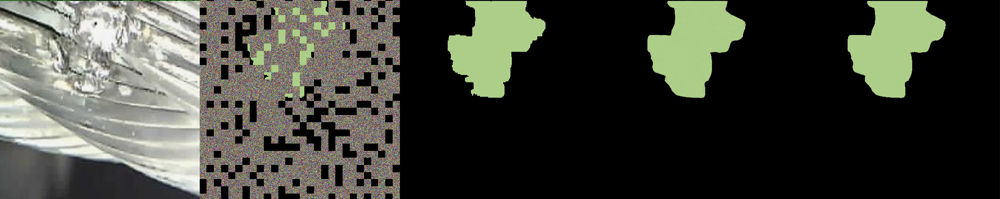
순서대로 [input image], [mask+ground truth], [ground truth], [패치별 예측 결과], [cmap_to_lbl로 계산한 최종 이미지]
### 추론
1. mapping_vit_filtered.json 파일로 input image 및 prompt image 설정  
key 값 : input image  
value 값 : prompt image(이때 label의 파일이름은 image의 파일이름과 동일해야합니다. 또한 n개의 이미지를 넣어줄 수 있습니다. 이렇게 넣어준 이미지는 아래의 inference.py의 top-k 인수를 조정하여, k개의 prompt만 사용되도록 만들어 줄 수 있습니다.)
2. inference 시작 명령  
인수 중 경로에 해당하는 model-path, prompt-img-dir, prompt-labe-dir, dataset-dir, mapping, outdir의 경우에는 알맞게 수정하여야합니다.  

```bash
python inference.py --model-path {가중치파일.pt 파일 경로} --prompt-img-dir {mapping_vit_filtered.json에 적어놓은 n-shot에 사용될 프롬프트 이미지 디렉토리} --prompt-label-dir {mapping_vit_filtered.json에 적어놓은 n-shot에 사용될 프롬프트 레이블 디렉토리 } --dataset-dir {mapping에 적어놓은 이미지가 있는 디렉토리} --mapping {mapping_vit_filtered.json 파일 경로} --top-k 1 --outdir {결과 디렉토리 설정} --split 2
```  

### Inference Output
---
inference.py를 이용해 원하는 사진에 segmentation을 진행할 수 있습니다.   

split 인수를 이용해 사진을 n^2 크기의 조각으로 잘라내 각각의 이미지에 모델을 이용해 segmentation을 진행해 최종결과를 뽑아낼 수 있습니다. (아래의 고찰에서 자세히 설명)

# 실험 및 고찰
## 학습 과정에 따른 결과
1. 정답레이블로 주어지는 레이블을 모두 색상을 랜덤하게 배정하여 학습을 시켰더니, inference 과정에서 아예 추론이 되지 않는 문제가 있었습니다.  
=> **이로서 배경은 검은색으로, 결함부분은 랜덤하게 색성을 배정하도록 수정하였습니다.**
2. 처음에 segGPT의 전신인 painter논문을 보지 않아 모델에 대한 제대로된 이해없이 학습을 수행하여 절반이 mask로 아예 가려진 상태로 학습을 하였는데, 이또한 추론과정에서 아예 추론이 되지 않는 문제가 발생하였습니다. painter 논문을 살펴보니 랜덤하게 마스크를 씌우고, 마스크가 씌워진 부분을 채워나가도록 모델이 학습되어야한다는 것을 깨닫고, 마스크가 랜덤하게 씌워질 수 있도록 수정하였습니다.
=> data.py의 **is_half 코드를 약간 수정하여, 학습시에는 false가 되도록 설정하였습니다.**
3. 마스크 비율은 0.4, 0.75(논문에서 사용한 값) 두개로 시도해보았는데, **0.4**로 하였더니, 아예 추론이 되지 않는 문제가 발생했습니다. 마스크가 많이 씌워져야, 모델이 마스크가 씌워진 부분의 결함을 예측하도록 훈련이 되는데, 너무 많이 정답이 보여지게 되어 이러한 훈련이 잘 되지 않은 것으로 보입니다. 따라서 최종 학습 시 이 값은 **0.75**로 설정하여 학습을 진행하였습니다.
## split에 따른 이미지 segmentation 결과
실험 결과, **split=2** 일때, 가장 높은 mIou를 보였습니다. 

결함이 작은 전자회로의 결함을 판별하는데는 split이 작을 수록 유리하였지만, 케이블의 결함과 같이 큰 결함의 경우에는 결함을 판별하는데 불리하게 작용하게되었습니다.  
### split = 1
|Open circuit|Cable|
|---|---|
|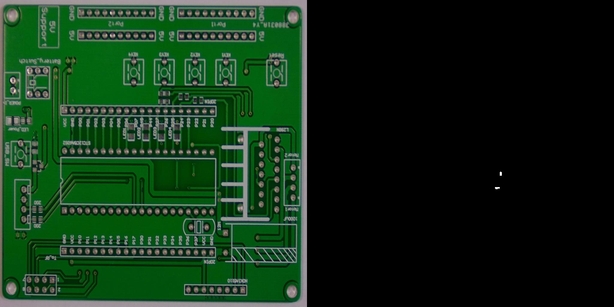||
|Iou : 0.0|Iou : 0.099|

### split = 2  
|Open circuit|Cable|
|---|---|
||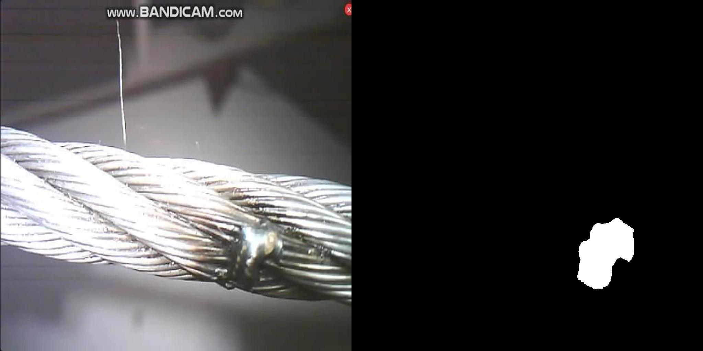|
|Iou : 0.39|Iou : 0.529  |

### split = 4
|Open circuit|Cable|
|---|---|
|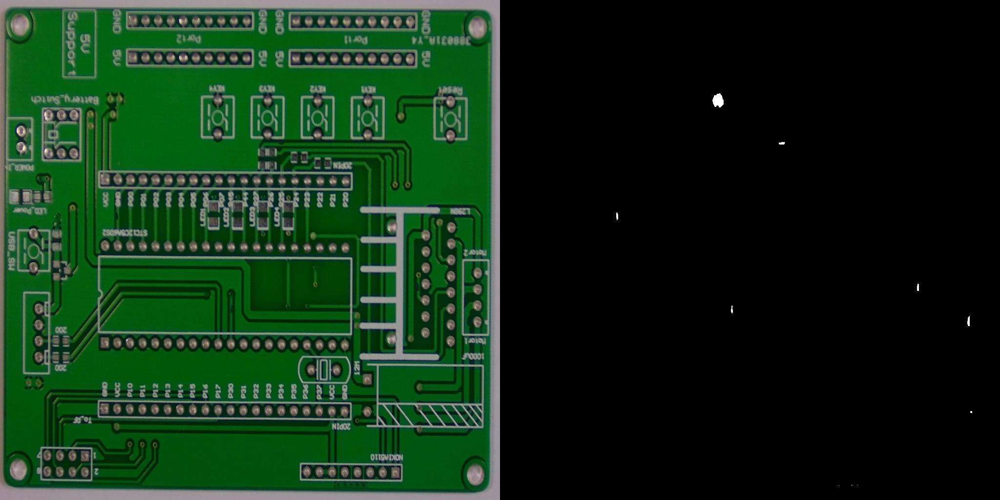|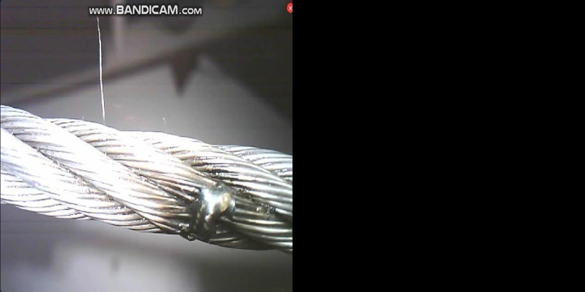|
|Iou : 0.46|Iou : 0.0|
     
너무 잘게 자른 경우, 큰 결함부위를 잘 예측하지 못하기 때문으로 보입니다.  

다음은 split에 따른 mIou 차이입니다.  
|split|mIou|  
|:-----:|:----:|  
|1|0.173|  
|2|**0.538**|  
|4|0.327|  
  
각 split별 iou의 결과는 ouput_split_{split} 디렉토리 내 **iou.txt**로 확인할 수 있습니다.  
테스트는 **train과정에서 사용되지 않은 11개의 서로다른 종류의 결함**으로 구성되어있습니다.  
# 결과
조건 :   
1. 전체 데이터셋의 절반을 학습에 사용(1epoch)  
2. split = 2  


## positive support image(input 이미지의 같은 종류의 결함에 해당하는 prompt) 사용 시
|Image|Iou(0.3↑)|Good Catch(good)|
|---|---|---|
|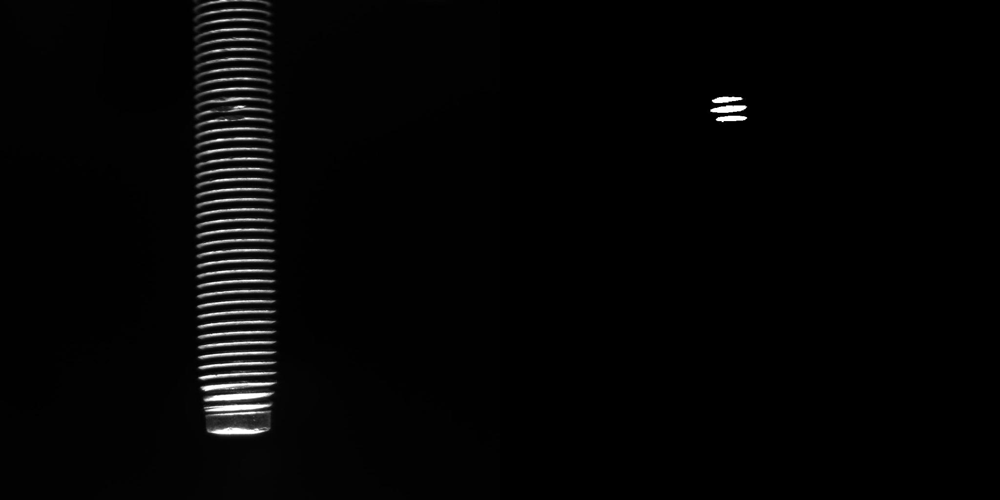|**0.843**|Yes|
|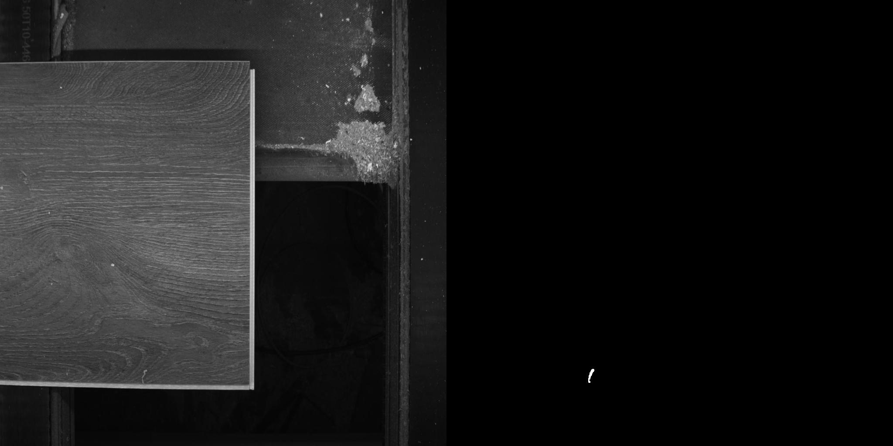|**0.777**|Yes|
|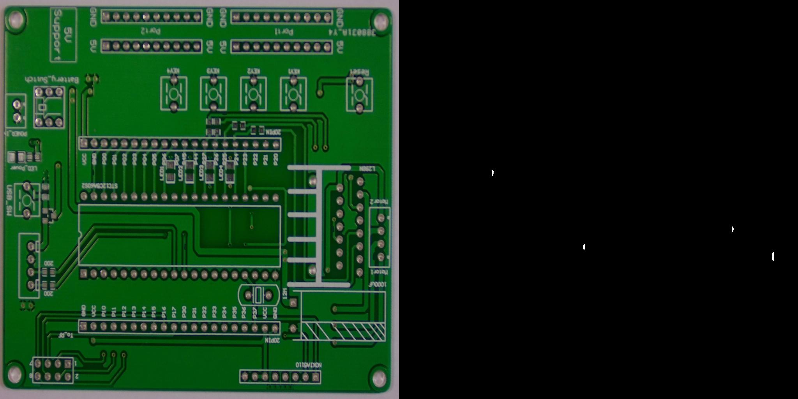|**0.424**|Yes|
||**0.562**|Yes|
||**0.419**|Yes|
|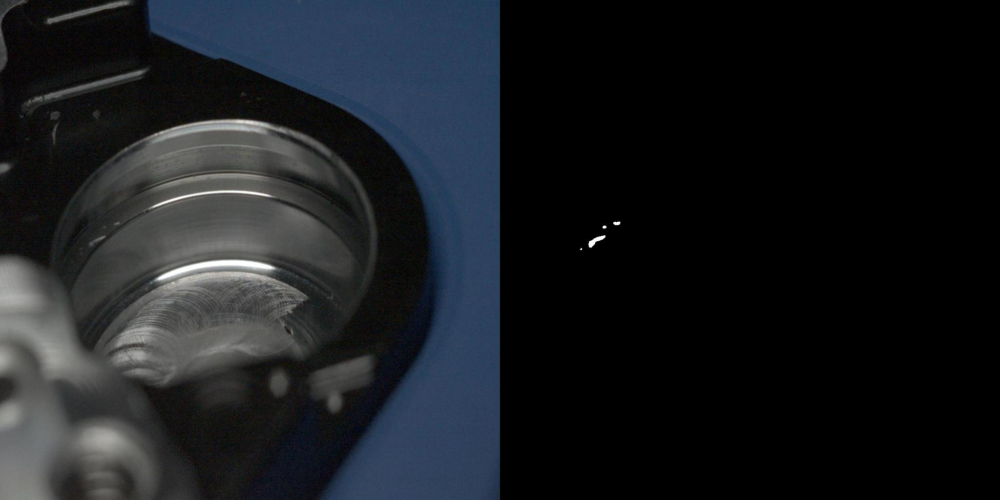|**0.623**|Yes|
|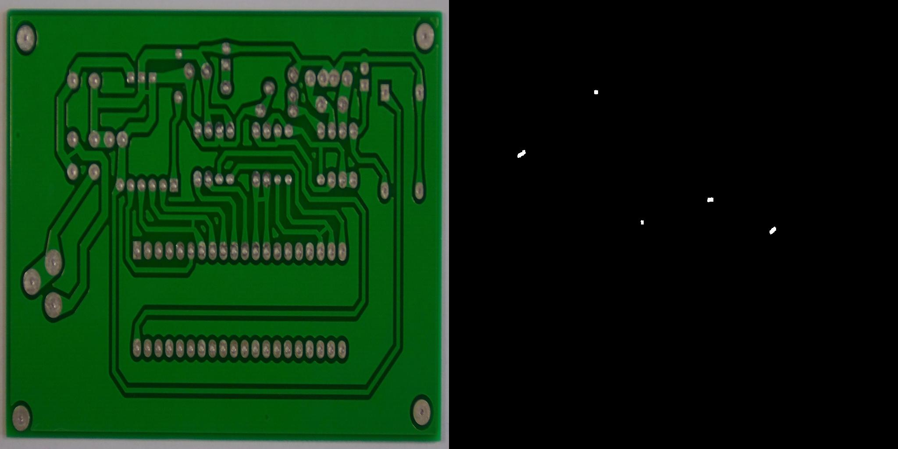|**0.608**|Yes|
|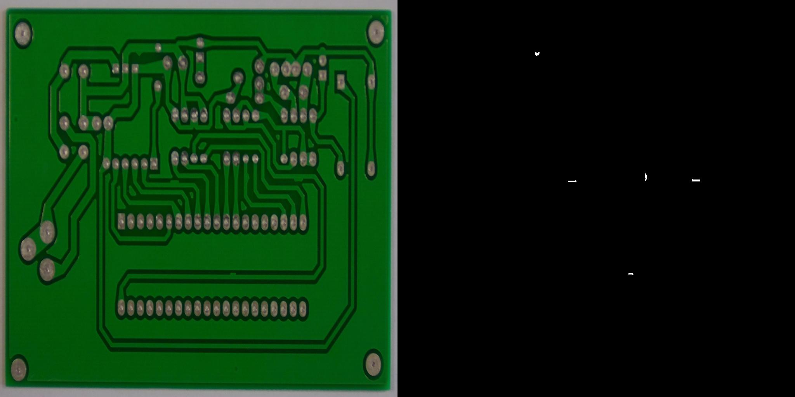|**0.508**|Yes|
||**0.609**|Yes|
||**0.534**|Yes|
|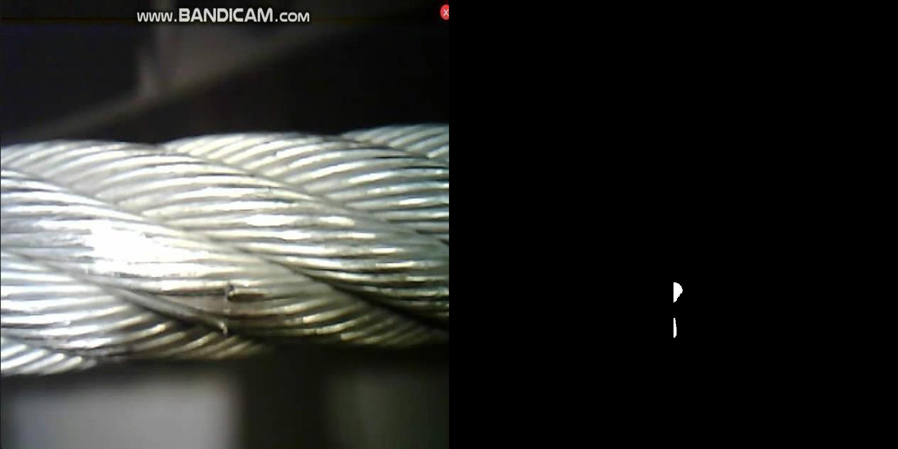|**0.044**|No|

|mIou|catch rate|
|---|---|
|**0.541**|**0.91**|  

(catch_rate = number of good catch / number of positive pairs)

## negative support image(input 이미지의 다른 종류의 결함에 해당하는 prompt) 사용 시
|Image|Iou(0.3↑)|Response rate(0.000239↓)|overkill(isn't good)|
|---|---|---|---|
|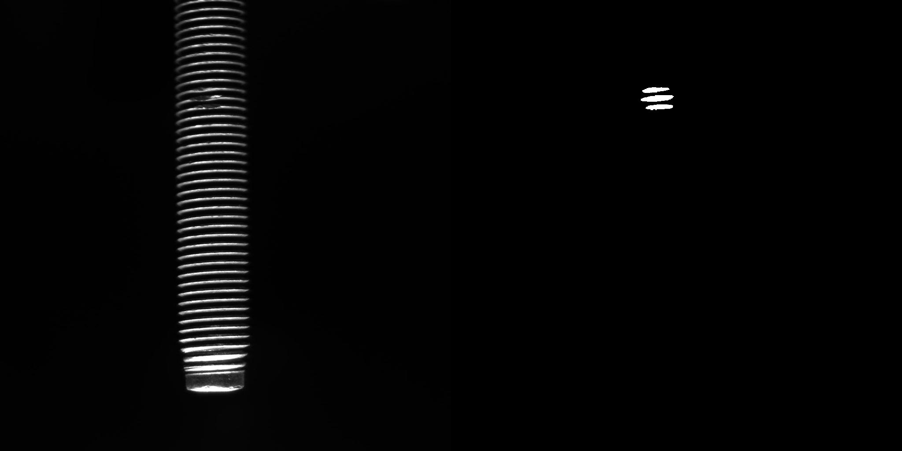|**0.858**|**0.000719**|Yes|
||**0.782**|**0.001883**|Yes|
||**0.422**|**0.000169**|No|
|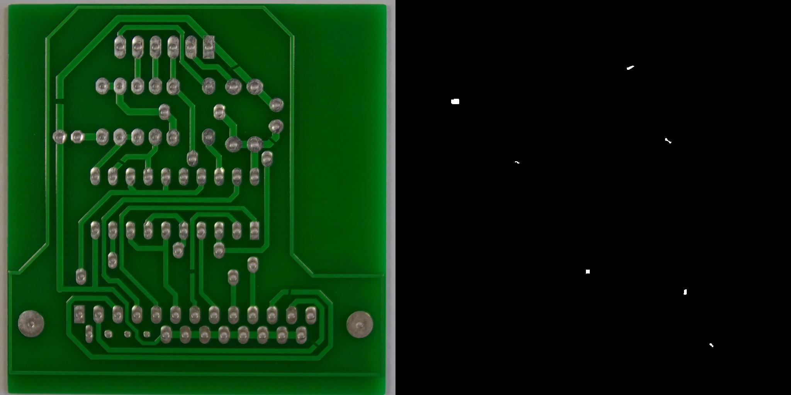|**0.489**|**0.000237**|No|
|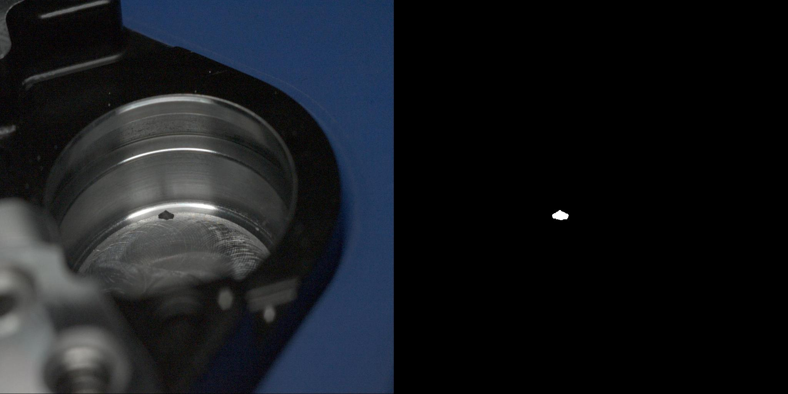|**0.382**|**0.000706**|Yes|
||**0.606**|**0.000431**|Yes|
||**0.624**|**0.000596**|Yes|
||**0.481**|**0.000362**|Yes|
|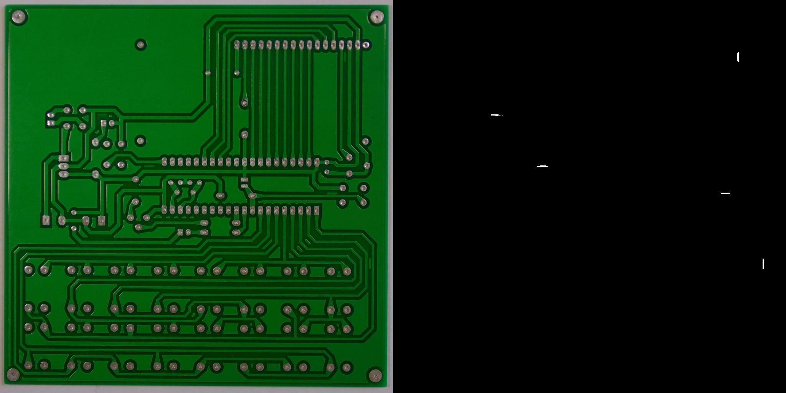|**0.600**|**0.000482**|Yes|
||**0.526**|**0.021971**|Yes|
||**0.032**|**0.000618**|Yes|

|mIou|yield rate|
|---|---|
|**0.527**|**0.182**|  
 
(yield_rate = number of correct yield / number of negative pairs)

## 최종 스코어
PES = 0.5⋅catch_rate+0.5⋅yield_rate  

### PES = 0.546


# 더 발전시킬 수 있는 것
segGPT 논문에 따르면 기존 모델의 가중치는 freeze한 채로 learnable image tensor를 이용해 input image와 함께 모델에 넣고, 이를 학습시키는 방법이 제안되었는데, 구현 방향을 잡지 못해 아직 구현하지 못하였습니다. 이는 앞으로 연구해보면 좋을 것 같습니다. 참고로 Painter를 소개한 논문인 Images Speak in Images 에 이 방법이 구체적으로 나와있어서 이를 참고하면 좋을 것 같습니다
  
# 수정 내역
- data.py 의 **_generate_color_palette, _lbl_random_color**을 수정하여, 훈련시 배경은 검은색으로 결함은 랜덤색상으로 배정될 수 있도록 수정.
- data.py 에서 **is_half**가 학습 과정에서는 false가 되도록 수정. -> 학습과정에서는 랜덤하게 마스크가 정답레이블에 씌워져야하기 때문에 그렇습니다.
- utils.py 의 **calculate_iou** 을 수정하여, 훈련시 올바르게 Iou가 측정될 수 있도록 수정.
- inference.py에서 iou를 계산하고, iou값을 텍스트파일로 내보내는 코드 추가.


